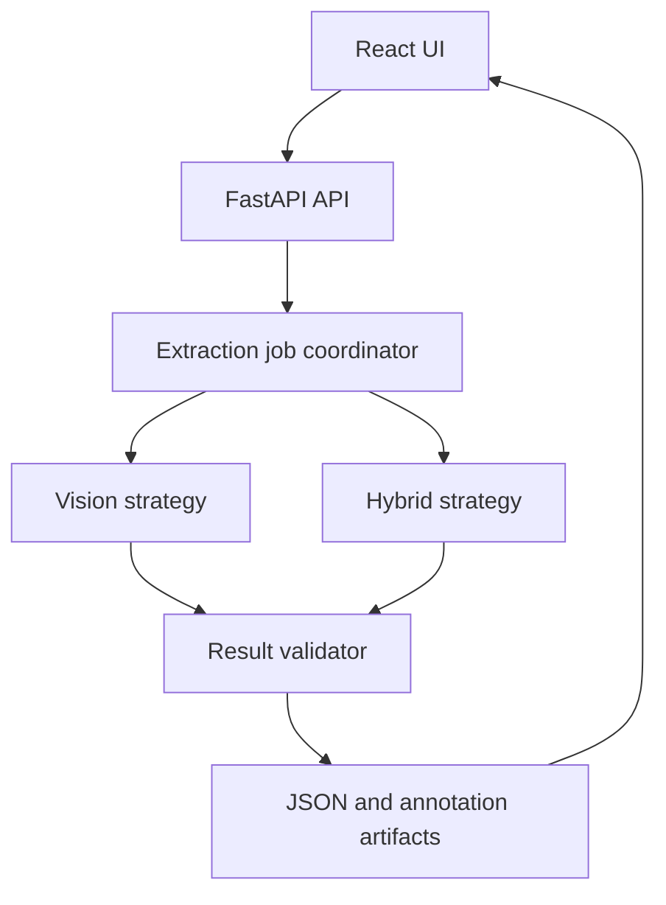

# Memory Waveform Extractor Design

**Status:** Approved by the product owner on 2026-08-18.

## Problem Statement

Memory timing diagrams in data sheets encode meaningful relationships between
signal state changes and timing parameters, but that information is difficult
to search, compare, and reuse programmatically. Engineers need a local-first
tool that accepts a clean, English, black-and-white timing-diagram image and
returns an auditable representation of the signal events and timing-parameter
relationships it depicts.

## Solution

Build a Python-based extractor with a FastAPI backend, React frontend, CLI,
and Python package. It accepts PNG, JPEG, or GIF input, renders the first GIF
frame when necessary, and creates a canonical JSON result plus an annotated
image. The UI lets the user choose one of two modes:

- `vision`: a local vision-language model produces grounded semantic
  relationships directly from the image.
- `hybrid`: OCR, image geometry, and timing-arrow detection create grounded
  evidence first; a local vision-language model only normalizes and explains
  the relationship graph.

Both modes emit exactly the same result schema and include confidence and
warnings. The `hybrid` mode is the default and is expected to offer better
traceability for data-sheet-style diagrams.

## In Scope

- Clean English timing diagrams with horizontal signal rows, vertical event
  anchors, timing arrows, and parameter labels such as `tWC`, `tAW`, and
  `tOHZ`.
- Signal labels, timing-parameter labels, arrow endpoints, event anchors,
  state-region labels, parameter-to-event relationships, confidence, and
  evidence coordinates.
- Signal states including high, low, valid, unknown, and high impedance when
  they can be inferred from visible drawing conventions or labels.
- Local model execution on Apple Silicon Macs and NVIDIA-backed systems.
- React UI, FastAPI API, CLI, Python library, Docker Compose, and a benchmark
  harness.

## Out of Scope

- Verilog/SVA generation and waveform conformance checking.
- Automatic use of external data sheets, product-specific glossaries, or
  manually supplied timing definitions.
- Handwritten, color-heavy, noisy, or arbitrarily laid-out waveform images.
- Authentication, tenant isolation, cloud storage, and multi-user scheduling.
- Claiming an electrical min/max specification when the image does not state
  it.

## User Stories

1. As a memory designer, I want to upload a timing-diagram image so that I can
   obtain a structured representation without manually transcribing arrows.
2. As a memory designer, I want to choose `vision` or `hybrid` mode so that I
   can compare speed, semantic coverage, and traceability.
3. As a reviewer, I want to select a timing parameter such as `tWC` and see
   its arrow, label, source event, and destination event highlighted.
4. As an automation developer, I want a stable JSON result so that I can feed
   extracted timing relations into later analysis or rule-generation tools.
5. As a local-first user, I want models to run on my own Mac or NVIDIA system
   so that images do not require a cloud model API.
6. As a maintainer, I want the model backend to be configurable so that an
   Ollama model, MLX OpenAI-compatible endpoint, or vLLM OpenAI-compatible
   endpoint can be selected without changing parsing logic.
7. As a quality owner, I want warnings and evidence coordinates for uncertain
   relations so that incorrect inferences are visible rather than hidden.
8. As a developer, I want CLI and Python APIs to call the same application
   service as the web API so that behavior remains consistent.

## Architecture

The application is organized around a canonical extraction contract. The
backend owns input validation, job orchestration, artifact persistence, the
two extraction strategies, and result validation. The frontend only creates
jobs and renders the canonical result.



### Model and OCR adapters

- `OllamaVisionProvider` is the default local model adapter and is expected to
  run on both Apple Silicon and NVIDIA systems.
- `OpenAICompatibleVisionProvider` targets local MLX and vLLM servers through
  their OpenAI-compatible HTTP interfaces.
- `TesseractOcrProvider` is the default deterministic OCR adapter. Tesseract
  is installed on the host and configured through `TESSERACT_CMD` when it is
  not on `PATH`.
- Tests use `FakeVisionProvider` and `FakeOcrProvider`; no CI test depends on
  GPU hardware or a downloaded model.

### Canonical contract

Each result contains document metadata, signals, events, timing parameters,
relations, warnings, and an annotated-image artifact reference. A timing
parameter points to explicit event IDs, not only signal names. Each grounded
element keeps image-space coordinates and an independent confidence score.

```json
{
  "timing_parameters": [
    {
      "id": "tp_twc",
      "name": "tWC",
      "from_event_id": "evt_address_valid_start",
      "to_event_id": "evt_next_address_change",
      "participant_signal_ids": ["sig_address"],
      "meaning": "interval between the two referenced address events",
      "confidence": 0.93,
      "evidence": {
        "label_bbox": [500, 65, 535, 85],
        "arrow_start_x": 218,
        "arrow_end_x": 698
      }
    }
  ]
}
```

### Job and artifact lifecycle

The API creates a job with a UUID and stores files under an application-owned
artifact root. `queued`, `running`, `completed`, `partial`, and `failed` are
the only job states. SQLite stores job metadata locally. The storage and job
repository are interfaces, so a future deployment can replace them without
changing API or frontend behavior.

### Error behavior

- Invalid or unsupported media returns a failed job with a machine-readable
  error code.
- Ambiguous arrows, unrecognized layout, missing OCR text, and local-model
  failures produce a `partial` result when verified relations remain.
- Relations below the configured confidence threshold are included only with a
  warning and never presented as confirmed facts.
- Animated GIFs use frame zero and add a warning that later frames were not
  analyzed.

## API and User Experience

- `POST /v1/extractions` accepts an image and a selected mode.
- `GET /v1/extractions/{id}` returns status, canonical result, and warnings.
- `GET /v1/extractions/{id}/artifacts/annotated-image` returns the rendered
  overlay.
- The React UI supports file upload, mode selection, polling, image switching,
  a timing-relation table, JSON viewing/downloading, and click-to-focus
  evidence highlighting.
- The CLI supports one file or a directory and writes canonical artifacts to a
  user-selected output directory.
- The Python library exposes one public `extract` operation and returns the
  same result model as the backend.

## Testing Decisions and Acceptance Criteria

- Unit tests cover schema validation, GIF frame selection, OCR normalization,
  arrow endpoint detection, event-graph construction, relation validation,
  confidence behavior, and annotation drawing.
- Integration tests cover fake local-model and fake OCR adapters, job API
  lifecycle, artifact retrieval, CLI output, and error responses.
- Frontend tests cover mode selection, upload state, job polling, relation
  selection, and warning rendering.
- The three user-provided timing diagrams form the initial golden sample set.
  Each must finish end-to-end in both modes with valid JSON and an annotation
  artifact. A human-reviewed expected-result file records signal labels,
  timing labels, and selected relations for each sample.
- The repository includes a benchmark command that reports signal-label F1,
  timing-label F1, relation F1, and the share of relations below the review
  threshold. Accuracy claims are deferred until at least 20 human-labeled
  diagrams exist.

## Global Constraints

- Python 3.11 or later.
- TypeScript strict mode.
- No cloud model API is required for normal operation.
- Input images and generated artifacts remain local by default.
- Secrets and model endpoints are supplied through environment variables and
  are never committed.
- The initial default mode is `hybrid`.
